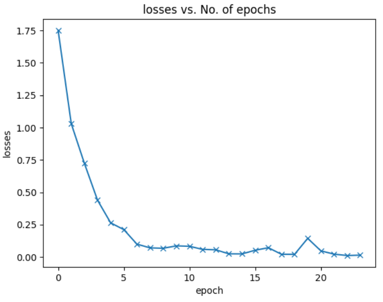

# Распознавание жестов с использованием PyTorch и ResNet

Этот проект представляет собой модель на основе ResNet, обученную распознавать жесты.

## Набор данных

Модель обучена на наборе данных [Hand Gesture Recognition Database](https://www.kaggle.com/datasets/gti-upm/leapgestrecog), содержащем изображения 10 классов различных жестов.

## Архитектура модели

Модель представляет собой упрощенную версию ResNet, состоящую из двух блоков. Первый блок включает сверточный слой с 64 фильтрами, сверточный слой с 64 фильтрами и max-pooling. Второй блок аналогичен, но с 128 фильтрами в каждом сверточном слое. Между блоками используются остаточные связи, а после второго блока — dropout слой с вероятностью 0.5 для регуляризации. Финальный классификатор включает глобальный average pooling, слой Flatten и линейный слой с 10 выходами для классификации 10 жестов.

## Предварительная обработка данных

Изображения подвергались следующим преобразованиям:
* Центральная обрезка до размера 240 x 440.
* Уменьшение размера до 100 x 183.
* Преобразование в оттенки серого.
* Преобразование в тензор PyTorch.

## Обучение и оценка

Модель обучалась с использованием оптимизатора Adam и функции потерь cross_entropy. Обучение проводилось в течение 24 эпох с размером батча 84.

На тестовом наборе модель показала следующие результаты:

* *Точность:* 97.71%
* *Полнота:* 97.70%
* *F1-мера:* 97.71%
* *Precision:* 97.87% 

## Использованные технологии

* Python
* NumPy
* PyTorch
* torchvision
* Matplotlib
* Scikit-learn
   
